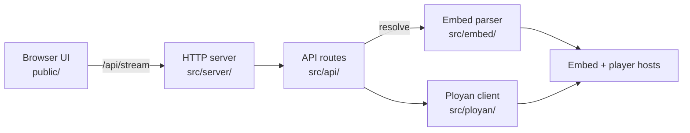

# ployan-stream-resolver

Self-hosted Node.js **HLS stream resolver**. Paste a Ployan embed page URL, resolve it to a direct **M3U8 master playlist** through a local **REST API**, decode the base64 player origin, build AES-256-GCM session tokens, and play back in the browser. Zero npm runtime dependencies.

## How the stream resolver works

- Fetches embed page HTML and extracts `mediaId` from `data-id` attributes or the URL slug
- Decodes the base64 `plyURL` constant in page JavaScript to discover the player origin
- Builds a time-bound token from `{mediaId}+{episode}+{server}+{timestamp}` with PBKDF2 and AES-256-GCM
- Calls `{origin}/get/{token}` and maps `direct` mode to `{origin}/hls/{info}/master.m3u8`
- Serves a small web UI with Safari native HLS playback and M3U8 copy for other browsers

## Quick start

```bash
npm start
```

Open `http://127.0.0.1:8765`, paste a Ployan embed page URL, click **Resolve**.

Requires Node.js 18+ (native `fetch`). Runs as a local **HTTP server** on port `8765` by default (`PORT` env override).

## Architecture



### Resolve flow

1. **Parse page** — `src/embed/parse.js` fetches embed HTML, extracts `mediaId`, decodes `plyURL`, reads the page title
2. **Seal token** — `src/ployan/stream.js` encrypts `{mediaId}+{episode}+1+{unixTimestamp}` with PBKDF2-SHA256 and AES-256-GCM
3. **Stream lookup** — `GET {origin}/get/{token}` with player referer returns `mode` and an opaque `info` value
4. **M3U8 URL** — when `mode` is `direct`, the HLS master playlist is `{origin}/hls/{info}/master.m3u8`
5. **Response** — JSON with `title`, `url`, and `mode` returned to the browser or API client

## Project layout

```
src/
  server/index.js     HTTP entry, static files, CORS
  api/routes.js       GET /api/health, GET /api/stream
  core/resolve.js     parse → fetch orchestration
  embed/parse.js      embed HTML extraction
  ployan/stream.js    AES token builder and /get client
  lib/
    config.js         host, port, user-agent
    http.js           upstream fetch helpers
public/
  index.html          UI shell and styles
  app.js              resolve, playback, copy
```

## Streaming API

### `GET /api/stream`

Resolves a Ployan embed page URL to a direct HLS master playlist link.

| Param | Required | Description |
| --- | --- | --- |
| `url` | yes | Full embed page URL |
| `episode` | no | Episode number in the token payload (default `1`) |

**Response**

```json
{
  "title": "Show Title",
  "url": "https://player.example/hls/abc123/master.m3u8",
  "mode": "direct"
}
```

`url` is set only when `/get` returns `mode: "direct"`. Resolver errors return HTTP `502` with `{ "error": "…" }`.

### `GET /api/health`

```json
{ "ok": true }
```

## Embed page requirements

The embed page must expose a Ployan player script with a base64 `plyURL` constant and a numeric `mediaId` via `data-id` on the player element (or a trailing `-{id}` slug in the URL path). The embed site and player host must be reachable from the machine running this server.

## Stack

- Node.js ES modules, zero npm runtime dependencies
- Native `fetch`, `node:http`, `node:crypto`
- Safari native HLS in the web UI; VLC or Stremio for other browsers
